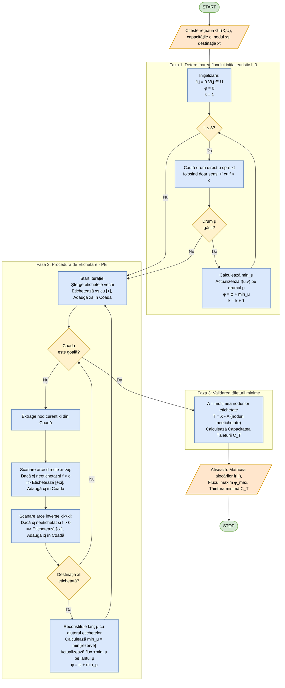
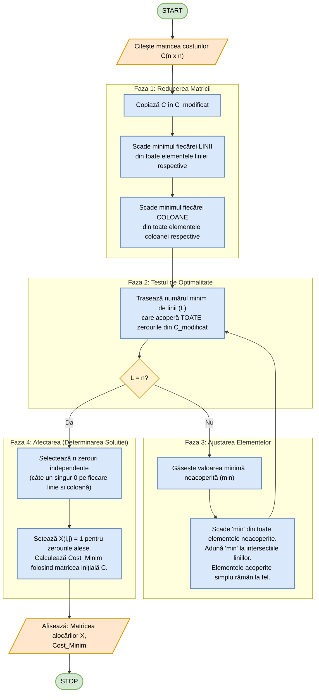

# Algoritmul Ford-Fulkerson - Flux Maxix

## Schema Logică a Algoritmului

```mermaid
flowchart TD
    classDef startend fill:#d5e8d4,stroke:#82b366,stroke-width:2px,color:#000
    classDef io fill:#ffe6cc,stroke:#d79b00,stroke-width:2px,color:#000
    classDef process fill:#dae8fc,stroke:#6c8ebf,stroke-width:2px,color:#000
    classDef decision fill:#fff2cc,stroke:#d6b656,stroke-width:2px,color:#000

    Start(["START"]):::startend --> Inp[/"Citește rețeaua G=(X,U), capacitățile c, nodul xs, destinația xt"/]:::io
    Inp --> Init["Inițializare:<br>fi,j = 0 ∀i,j ∈ U<br>φ = 0<br>k = 1"]:::process

    subgraph Faza_1["Faza 1: Determinarea fluxului inițial euristic I_0"]
        direction TB
        Init --> CondK{"k ≤ 3?"}:::decision
        CondK -->|Da| Search["Caută drum direct μ spre xt<br>folosind doar sens '+' cu f < c"]:::process
        Search --> Found{"Drum μ<br>găsit?"}:::decision
        Found -->|Da| UpdateI0["Calculează min_μ<br>Actualizează f(u,v) pe drumul μ<br>φ = φ + min_μ<br>k = k + 1"]:::process
        UpdateI0 --> CondK
    end

    CondK -->|Nu| StartPE
    Found -->|Nu| StartPE

    subgraph Faza_2["Faza 2: Procedura de Etichetare - PE"]
        direction TB
        StartPE["Start Iterație:<br>Șterge etichetele vechi<br>Etichetează xs cu [+], Adaugă xs în Coadă"]:::process --> CheckQ{"Coada<br>este goală?"}:::decision
        CheckQ -->|Nu| PopQ["Extrage nod curent xi din Coadă"]:::process
        PopQ --> ScanF["Scanare arce directe xi->xj:<br>Dacă xj neetichetat și f < c<br>=> Etichetează [+xi], Adaugă xj în Coadă"]:::process
        ScanF --> ScanB["Scanare arce inverse xj->xi:<br>Dacă xj neetichetat și f > 0<br>=> Etichetează [-xi], Adaugă xj în Coadă"]:::process
        ScanB --> CheckDest{"Destinația xt<br>etichetată?"}:::decision
        CheckDest -->|Nu| CheckQ
        CheckDest -->|Da| UpdatePE["Reconstituie lanț μ cu ajutorul etichetelor<br>Calculează min_μ = min{rezerve}<br>Actualizează flux ±min_μ pe lanțul μ<br>φ = φ + min_μ"]:::process
        UpdatePE --> StartPE
    end

    subgraph Faza_3["Faza 3: Validarea tăieturii minime"]
        direction TB
        CheckQ -->|Da| Cut["A = mulțimea nodurilor etichetate<br>T = X - A (noduri neetichetate)<br>Calculează Capacitatea Tăieturii C_T"]:::process
    end

    Cut --> Outp[/"Afișează: Matricea alocărilor f(i,j),<br>Fluxul maxim φ_max, Tăietura minimă C_T"/]:::io
    Outp --> End(["STOP"]):::startend
```
# Algoritmul Ungar - Cuplaj Maxim cu valoare optima minima/maximă

## Schema Logică a Algoritmului

```mermaid
flowchart TD
    %% Stilizare generală
    classDef startend fill:#d5e8d4,stroke:#82b366,stroke-width:2px,color:#000
    classDef io fill:#ffe6cc,stroke:#d79b00,stroke-width:2px,color:#000
    classDef process fill:#dae8fc,stroke:#6c8ebf,stroke-width:2px,color:#000
    classDef decision fill:#fff2cc,stroke:#d6b656,stroke-width:2px,color:#000

    %% START / INTRARE DATE
    Start(["START"]):::startend --> Inp[/"Citește matricea costurilor C(n x n)"/]:::io
    Inp --> Init["Copiază C în C_modificat"]:::process

    %% ================= FAZA 1 =================
    subgraph Faza_1 ["Faza 1: Reducerea Matricii"]
        direction TB
        Init --> Lin["Scade minimul fiecărei LINII<br>din toate elementele liniei respective"]:::process
        Lin --> Col["Scade minimul fiecărei COLOANE<br>din toate elementele coloanei respective"]:::process
    end

    %% ================= FAZA 2 =================
    subgraph Faza_2["Faza 2: Testul de Optimalitate"]
        direction TB
        Col --> Lines["Trasează numărul minim de linii (L)<br>care acoperă TOATE zerourile din C_modificat"]:::process
        Lines --> CheckL{"L = n?"}:::decision
    end

    %% ================= FAZA 3 =================
    subgraph Faza_3 ["Faza 3: Ajustarea Elementelor"]
        direction TB
        CheckL -->|Nu| MinUnc["Găsește valoarea minimă neacoperită (min)"]:::process
        MinUnc --> Adj["Scade 'min' din toate elementele neacoperite.<br>Adună 'min' la intersecțiile liniilor.<br>Elementele acoperite simplu rămân la fel."]:::process
        Adj --> Lines
    end

    %% ================= FAZA 4 =================
    subgraph Faza_4 ["Faza 4: Afectarea (Determinarea Soluției)"]
        direction TB
        CheckL -->|Da| Assign["Selectează n zerouri independente<br>(câte un singur 0 pe fiecare linie și coloană)"]:::process
        Assign --> CalcCost["Setează X(i,j) = 1 pentru zerourile alese.<br>Calculează Cost_Minim folosind matricea inițială C."]:::process
    end

    %% IEȘIRE DATE / STOP
    CalcCost --> Outp[/"Afișează: Matricea alocărilor X,<br>Cost_Minim"/]:::io
    Outp --> End(["STOP"]):::startend
```
