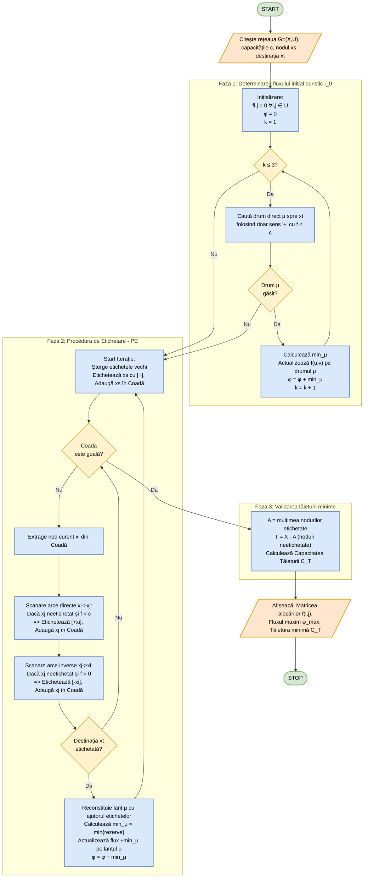
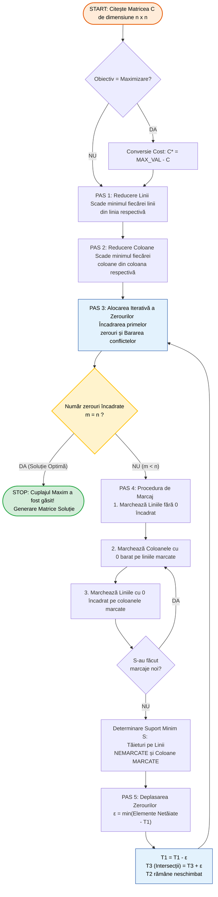

# Algoritmul Ford-Fulkerson - Flux Maxim

## Schema Logică a Algoritmului

```mermaid
flowchart TD
    classDef startend fill:#d5e8d4,stroke:#82b366,stroke-width:2px,color:#000
    classDef io fill:#ffe6cc,stroke:#d79b00,stroke-width:2px,color:#000
    classDef process fill:#dae8fc,stroke:#6c8ebf,stroke-width:2px,color:#000
    classDef decision fill:#fff2cc,stroke:#d6b656,stroke-width:2px,color:#000

    Start(["START"]):::startend --> Inp[/"Citește rețeaua G=(X,U), capacitățile c, nodul xs, destinația xt"/]:::io
    Inp --> Init["Inițializare:<br>fi,j = 0 ∀i,j ∈ U<br>φ = 0<br>k = 1"]:::process

    subgraph Faza_1["Faza 1: Determinarea fluxului inițial euristic I_0"]
        direction TB
        Init --> CondK{"k ≤ 3?"}:::decision
        CondK -->|Da| Search["Caută drum direct μ spre xt<br>folosind doar sens '+' cu f < c"]:::process
        Search --> Found{"Drum μ<br>găsit?"}:::decision
        Found -->|Da| UpdateI0["Calculează min_μ<br>Actualizează f(u,v) pe drumul μ<br>φ = φ + min_μ<br>k = k + 1"]:::process
        UpdateI0 --> CondK
    end

    CondK -->|Nu| StartPE
    Found -->|Nu| StartPE

    subgraph Faza_2["Faza 2: Procedura de Etichetare - PE"]
        direction TB
        StartPE["Start Iterație:<br>Șterge etichetele vechi<br>Etichetează xs cu [+], Adaugă xs în Coadă"]:::process --> CheckQ{"Coada<br>este goală?"}:::decision
        CheckQ -->|Nu| PopQ["Extrage nod curent xi din Coadă"]:::process
        PopQ --> ScanF["Scanare arce directe xi->xj:<br>Dacă xj neetichetat și f < c<br>=> Etichetează [+xi], Adaugă xj în Coadă"]:::process
        ScanF --> ScanB["Scanare arce inverse xj->xi:<br>Dacă xj neetichetat și f > 0<br>=> Etichetează [-xi], Adaugă xj în Coadă"]:::process
        ScanB --> CheckDest{"Destinația xt<br>etichetată?"}:::decision
        CheckDest -->|Nu| CheckQ
        CheckDest -->|Da| UpdatePE["Reconstituie lanț μ cu ajutorul etichetelor<br>Calculează min_μ = min{rezerve}<br>Actualizează flux ±min_μ pe lanțul μ<br>φ = φ + min_μ"]:::process
        UpdatePE --> StartPE
    end

    subgraph Faza_3["Faza 3: Validarea tăieturii minime"]
        direction TB
        CheckQ -->|Da| Cut["A = mulțimea nodurilor etichetate<br>T = X - A (noduri neetichetate)<br>Calculează Capacitatea Tăieturii C_T"]:::process
    end

    Cut --> Outp[/"Afișează: Matricea alocărilor f(i,j),<br>Fluxul maxim φ_max, Tăietura minimă C_T"/]:::io
    Outp --> End(["STOP"]):::startend
```
# Algoritmul Ungar - Cuplaj Maxim cu valoare optimă minima/maximă

## Schema Logică a Algoritmului

```mermaid
graph TD
    A(["START: Citește Matricea C de dimensiune n x n"]) --> B{"Obiectiv = Maximizare?"}
    
    B -- DA --> C["Conversie Cost: C* = MAX_VAL - C"]
    B -- NU --> D["PAS 1: Reducere Linii <br> Scade minimul fiecărei linii din linia respectivă"]
    
    C --> D
    D --> E["PAS 2: Reducere Coloane <br> Scade minimul fiecărei coloane din coloana respectivă"]
    
    E --> F["PAS 3: Alocarea Iterativă a Zerourilor <br> Încadrarea primelor zerouri și Bararea conflictelor"]
    
    F --> G{"Număr zerouri încadrate <br> m = n ?"}
    
    G -- "DA (Soluție Optimă)" --> H(["STOP: Cuplajul Maxim a fost găsit! <br> Generare Matrice Soluție"])
    
    G -- "NU (m < n)" --> I["PAS 4: Procedura de Marcaj <br> 1. Marchează Liniile fără 0 încadrat"]
    I --> J["2. Marchează Coloanele cu 0 barat pe liniile marcate"]
    J --> K["3. Marchează Liniile cu 0 încadrat pe coloanele marcate"]
    
    K --> L{"S-au făcut <br> marcaje noi?"}
    L -- DA --> J
    L -- NU --> M["Determinare Suport Minim S: <br> Tăieturi pe Linii NEMARCATE și Coloane MARCATE"]
    
    M --> N["PAS 5: Deplasarea Zerourilor <br> ε = min(Elemente Netăiate - T1)"]
    
    N --> O["T1 = T1 - ε <br> T3 (Intersecții) = T3 + ε <br> T2 rămâne neschimbat"]
    
    O --> F
    
    style A fill:#ffecd9,stroke:#e65c00,stroke-width:2px,color:#000
    style H fill:#d4edda,stroke:#28a745,stroke-width:2px,color:#000
    style G fill:#fff3cd,stroke:#ffc107,stroke-width:2px,color:#000
    style F fill:#e3f2fd,stroke:#0d47a1,stroke-width:1px,color:#000
    style O fill:#e3f2fd,stroke:#0d47a1,stroke-width:1px,color:#000
```
